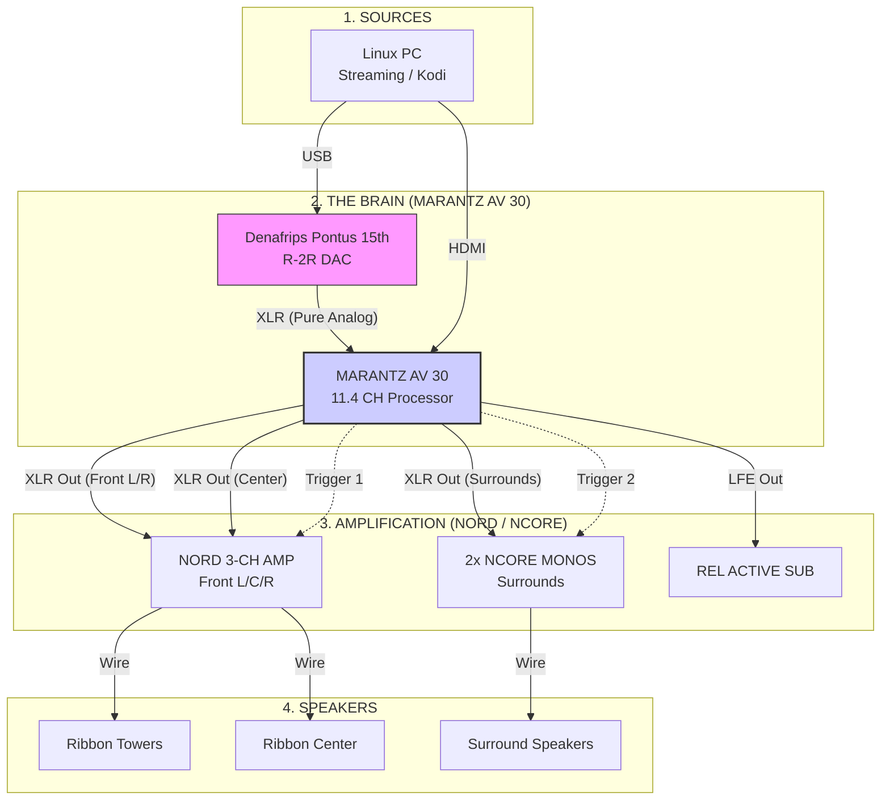

# System Blueprint: Marantz Reference 5.1 Hybrid (2026 Consolidation)

## 1. Executive Summary
This configuration eliminates the separate analog preamplifier in favor of the **Marantz AV 30 Reference Processor**. This setup prioritizes simplicity and automation while maintaining an audiophile-grade "Pure Direct" analog path for the Denafrips R-2R DAC. 

## 2. Hardware Manifest
* **Brain:** Marantz AV 30 (11.4 Balanced Pre-amplifier).
* **DAC:** Denafrips Pontus 15th (Connected via Balanced XLR).
* **Front Amp:** Nord One NCx500 3-Channel (L/C/R) with Sparkos SS2590 Op-Amps.
* **Surround Amp:** 2x NCore Mono Blocks (LS/RS).
* **Subwoofer:** REL HT/1205 (Active).
* **Display:** Epson EH-TW5910 (1080p).

## 3. The "Pure Direct" Signal Path
For 2-channel music, the Marantz AV 30 operates as a high-end analog preamp:
1. **Source:** Linux PC → USB → **Denafrips Pontus**.
2. **Path:** Denafrips (XLR) → **Marantz XLR Analog Input**.
3. **Mode:** Marantz set to **"Pure Direct"**.
   - *Result:* All digital circuitry, video processing, and displays are powered down. The signal stays analog from the DAC through the HDAM-SA2 buffer to the Nord Amps.

## 4. Automation & Trigger Settings
The Marantz AV 30 manages power for the entire room via its **12V Trigger Out** menu.

| Trigger | Target | Logic: "Music Mode" (CD Input) | Logic: "Movie Mode" (TV Input) |
| :--- | :--- | :--- | :--- |
| **Out 1** | Nord 3-Ch (Fronts) | **ON** | **ON** |
| **Out 2** | NCore Monos (Rears) | **OFF** | **ON** |

### How to configure "Music Mode":
In the Marantz Menu (**Setup > General > Trigger Out**):
1. Set **Trigger 1** to activate for the **CD** (DAC) input.
2. Set **Trigger 2** to remain **OFF** for the **CD** input.
3. *Benefit:* When listening to music, your surround amplifiers stay cold and save power.

## 5. "Finicky" Projector Configuration
To stabilize the Epson EH-TW5910 1080p handshake:
* **Video Output:** Lock Marantz to **1080p Fixed**.
* **HDMI-CEC:** Disable if the system "auto-switches" incorrectly during background music sessions.
* **Cable:** Use 15m **Active Optical HDMI (AOC)** to ensure consistent 5V handshakes.

## 6. Linux Software Integration
* **Music:** CamillaDSP applies FIR filters in the digital domain on the PC.
* **Output:** ALSA directed to `hw:DAC` (Denafrips).
* **Background Audio:** Use **PipeWire** to mix game/background audio into the Denafrips stream if 5.1 is not required for the session.

