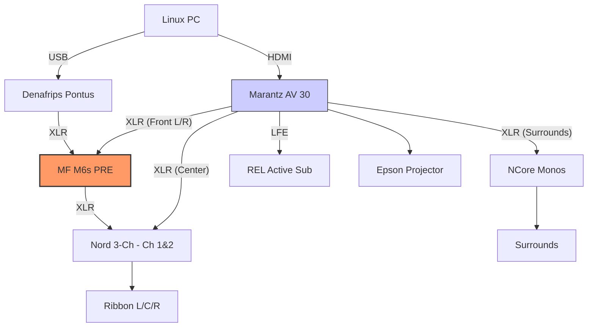

## 5. System Diagram (Mermaid)

```mermaid
graph TD
    PC[Linux PC] -- USB --> DAC[Denafrips Pontus]
    PC -- HDMI --> AVP[Marantz AV 30]

    DAC -- XLR --> MF[MF M6s PRE]
    AVP -- "XLR (Front L/R)" --> MF

    MF -- XLR --> Amp1[Nord 3-Ch - Ch 1&2]
    AVP -- "XLR (Center)" --> Amp1
    AVP -- "XLR (Surrounds)" --> Amp2[NCore Monos]
    AVP -- "LFE" --> Sub[REL Active Sub]

    Amp1 --> Speakers[Ribbon L/C/R]
    Amp2 --> RearSpeakers[Surrounds]
    AVP --> Proj[Epson Projector]

    style MF fill:#f96,stroke:#333,stroke-width:2px
    style AVP fill:#ccf,stroke:#333
```

